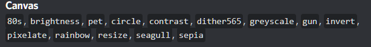

# Canvas



## 80s

Apply an 80s filter to your image



```text
g!80s @user
```



```text
g!80s
```

* This will use the last image in the channel



```text
g!80s
```

Add g!80s "as a comment" when uploading the image  
Example










## Brightness




```text
g!brightness @user
```



```text
g!brightness
```

* This will use the last image in the channel



```text
g!brightness
```

Add g!brightness "as a comment" when uploading the image







## Pet

## Circle

## Contrast

## Dither565

## Grayscale

## Gun 🔫

## Invert

## Pixelate

## Rainbow

## Resize

## Seagull

## Sepia

